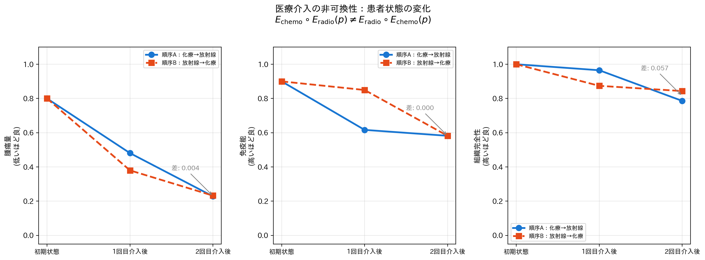
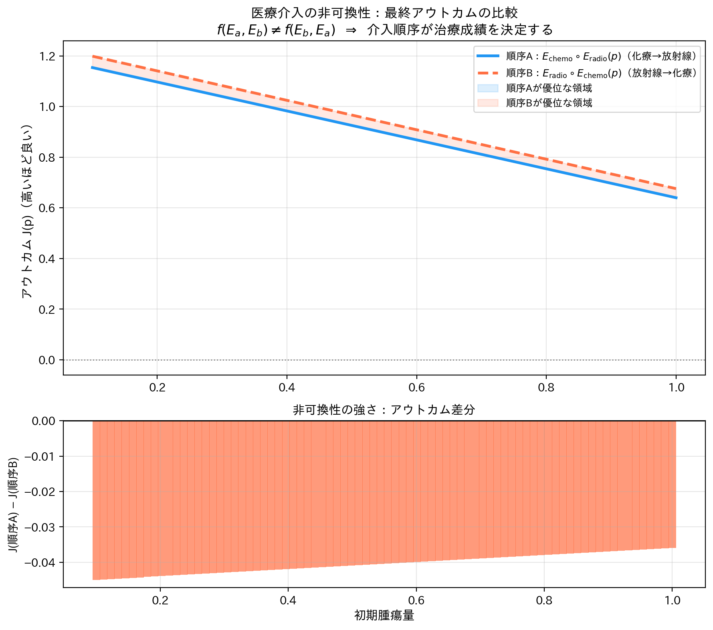
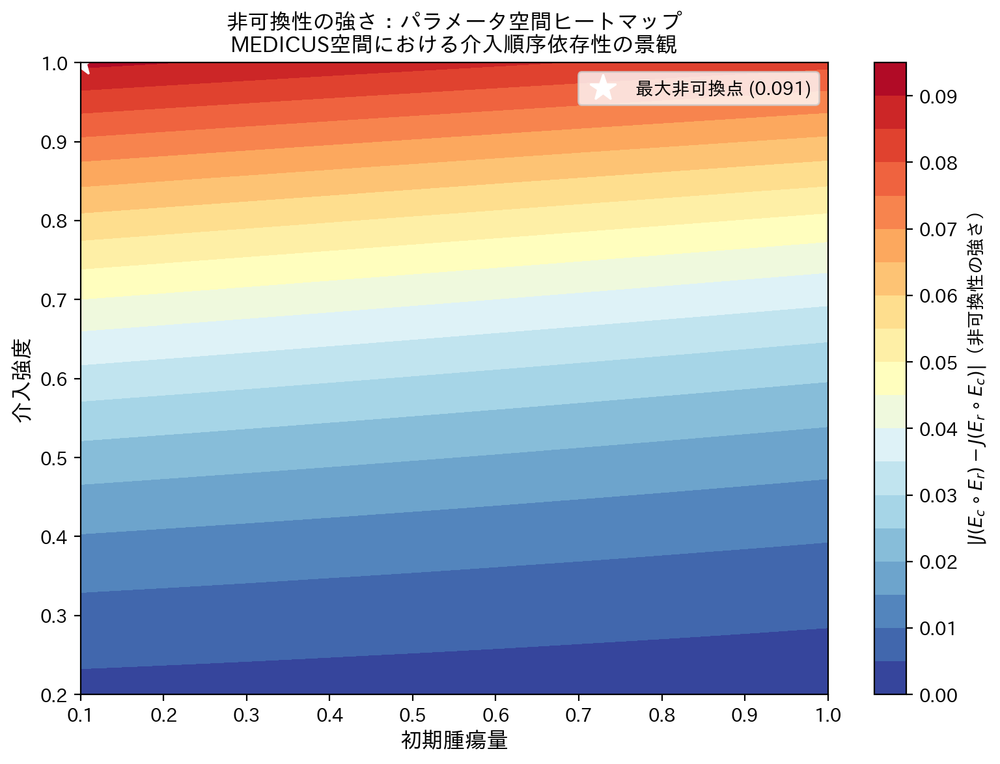
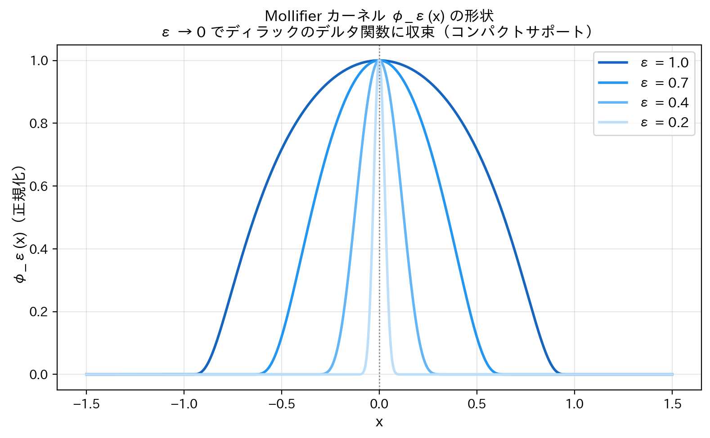
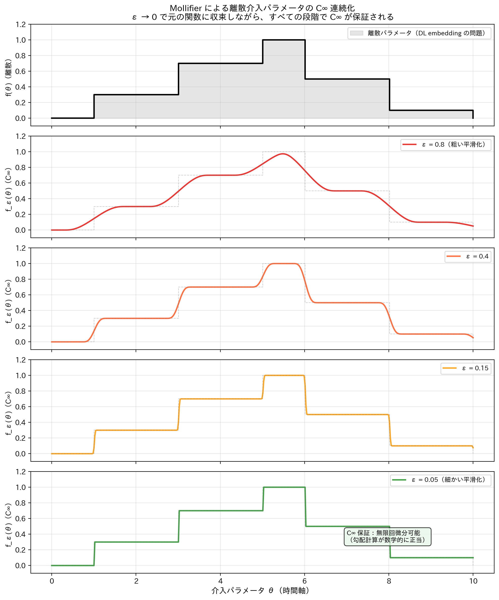
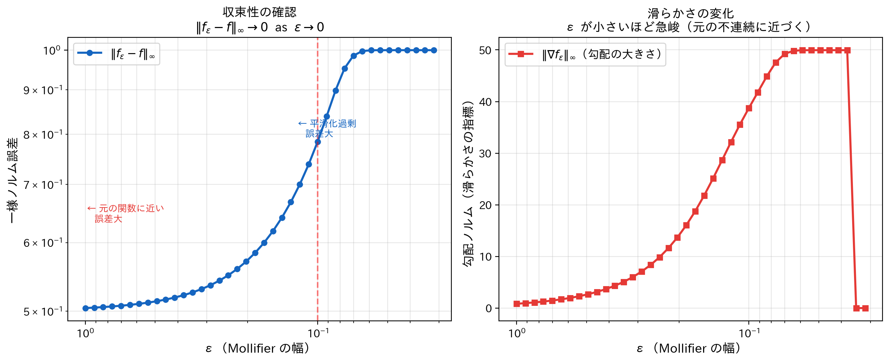
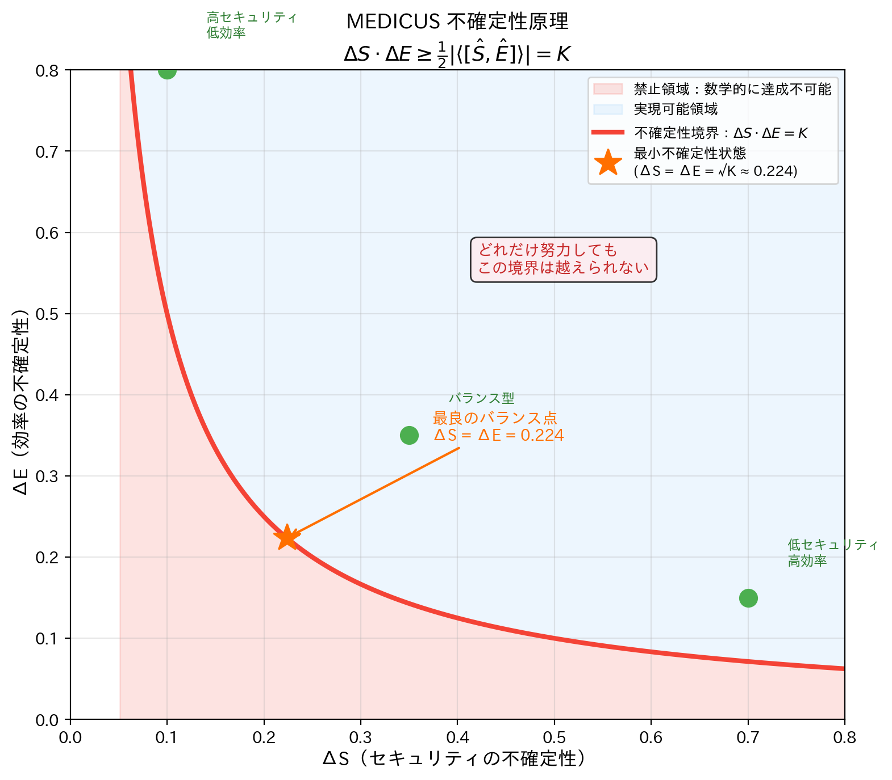
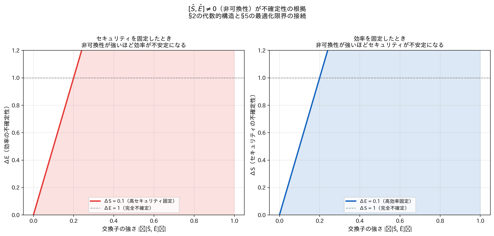
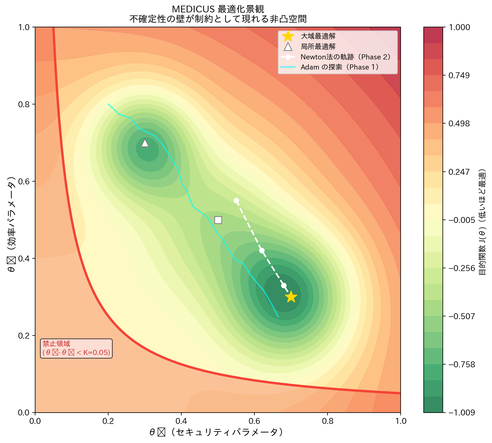

# MEDICUS Theory — 視覚化ギャラリー

`img/` ディレクトリに生成される 9 枚の図の詳解。
実行：`uv run python run_all.py`

---

> **免責事項（2026-03-10 時点）**
>
> このディレクトリ内のすべての図は、**理論的命題の数学的・概念的検証を目的としたシミュレーション結果**です。
>
> - 患者状態モデル（腫瘍量・免疫能・組織完全性）および介入関数（`E_chemo`, `E_radio`）に使用されているパラメータ値は、**理論の構造を例示するために設定された仮想値**であり、実際の臨床データや医学的エビデンスに基づくものではありません。
> - 図中のアウトカム数値・不確定性定数 K・Mollifier の ε 値はいずれも**例示用の仮定値**です。実臨床での治療効果・投薬量・リスクを示すものではありません。
> - 本資料は医療行為・治療方針の根拠として使用することを意図していません。臨床判断は必ず担当医師の専門的判断に従ってください。
>
> これらの図はあくまで「介入の非可換性」「C∞ 連続化」「不確定性原理」という**数学的構造の視覚化**を目的としています。

---

## 1. 医療介入の非可換性 (`noncommutativity.py`)

### 図 01 — 患者状態軌跡の比較



**何を示しているか**
1 人の患者に対して「化療 → 放射線」と「放射線 → 化療」の 2 通りの順序を適用したとき、
患者状態ベクトル *p* = (腫瘍量, 免疫能, 組織完全性) がどのように変化するかを並べて示す。

**読み方**
- 青系の折れ線：順序 A（化療 → 放射線）
- 橙系の折れ線：順序 B（放射線 → 化療）
- 3 次元それぞれで最終値が異なる → **同じ介入でも順序が違えば別の状態に到達する**

**理論的意味**
MEDICUS の核心命題 Eₐ∘E_b(p) ≠ E_b∘Eₐ(p) をモデル値で直接確認。
生物学的根拠：化療は免疫を抑制する → 免疫が低下した状態での放射線治療は組織修復能力が落ちる。

---

### 図 02 — アウトカム比較と非可換性の定量化



**何を示しているか**
初期腫瘍量を 0.1〜1.0 に連続的に変化させたとき、
アウトカム関数 *J(p) = −2·腫瘍量 + 1·免疫能 + 0.8·組織完全性* の最終値を 2 つの順序で比較する。

**読み方（上段）**
- 2 本の曲線が常にずれている → **全パラメータ域で非可換**
- 青の塗り領域：順序 A が優位、橙の塗り領域：順序 B が優位
- 最適な順序は患者の初期状態に依存することが視覚的に明らか

**読み方（下段）**
差分 J(順序A) − J(順序B) を棒グラフで表示。
非ゼロであることが **非可換性の定量的証明** になる。

---

### 図 03 — 非可換性強度のヒートマップ



**何を示しているか**
パラメータ空間（初期腫瘍量 × 介入強度）上で非可換性の強さ
|J(Ec∘Er) − J(Er∘Ec)| をヒートマップ表示する。

**読み方**
- 赤いほど順序の影響が大きい（どちらを先にするかで大きく結果が変わる）
- 白星マーク：非可換性が最大となる点 → **この領域では治療順序の決定が最も重要**
- 青い領域：どちらの順序でも結果が似ている（順序の自由度が高い）

**実臨床への含意**
ヒートマップ上で患者の現在地を特定することで、「今この患者には順序を慎重に選ぶ必要があるか」を数学的に判断できる。

---

## 2. Mollifier による C∞ 連続化 (`mollifier.py`)

### 図 04 — Mollifier カーネルの形状



**何を示しているか**
Friedrichs Mollifier のカーネル関数

$$\varphi_\varepsilon(x) = C \cdot \exp\!\left(-\frac{1}{\varepsilon^2 - x^2}\right) \quad (|x| < \varepsilon)$$

の形状を ε = 1.0, 0.7, 0.4, 0.2 で比較する。

**読み方**
- ε が小さいほど鋭いピーク → ε → 0 でディラックのデルタ関数 δ(x) に収束
- **コンパクトサポート**：サポートが区間 (−ε, ε) に厳密に限られる
  - これが「C∞ だが非解析的」の理由。テイラー展開が遠方まで届かない = 安全な外挿の保証

**DL との対比**
深層学習の embedding は連続性を「暗黙に仮定」するが、Mollifier は C∞ を **証明付きで保証** する。

---

### 図 05 — 離散介入パラメータの C∞ 連続化



**何を示しているか**
臨床での投薬量のような離散的なステップ関数（低用量→中用量→高用量→漸減→維持）を
Mollifier で畳み込むことで C∞ 関数へ変換していく過程を示す。

**読み方（上から下へ）**
1. 最上段（黒）：元の離散パラメータ — 勾配計算が数学的に正当化されない
2. ε = 0.8：全体的に丸くなるが元の形を損なう
3. ε = 0.4：形を保ちつつ滑らかに
4. ε = 0.15：元の関数に近い C∞ 関数
5. ε = 0.05（緑）：ほぼ元の形を保ちながら C∞ を達成 — **実用的な設定**

**注釈の意味**
最下段の「C∞ 保証：無限回微分可能（勾配計算が数学的に正当）」は、
Adam/AdaGrad・Newton 法を適用できる **根拠** が成立したことを示す。

---

### 図 06 — ε → 0 での収束性の定量確認



**何を示しているか**
ε を連続的に小さくしていったとき、2 つの量がどう変化するかを対数スケールで示す。

**左グラフ：近似誤差 ‖f_ε − f‖∞**
- ε → 0 で誤差も 0 に収束 → **近似の妥当性**
- ε が大きすぎると「平滑化しすぎ」で誤差増大（左側の高い値）

**右グラフ：勾配ノルム ‖∇f_ε‖∞**
- ε が小さいほど急峻（元の不連続な形に近づく）
- ε が大きいほど緩やか → 勾配降下法が安定するトレードオフ

**ε の選択指針**
右グラフと左グラフを両立する「適度な ε」が最適。臨床パラメータの粒度に応じて調整する。

---

## 3. 不確定性原理と最適化の限界 (`uncertainty.py`)

### 図 07 — 不確定性境界と実現可能領域



**何を示しているか**
MEDICUS 不確定性原理 ΔS·ΔE ≥ ½|⟨[Ŝ, Ê]⟩| = K を 2 次元空間で視覚化する。
横軸：ΔS（セキュリティの不確定性）、縦軸：ΔE（効率の不確定性）。

**読み方**
- 赤の双曲線：不確定性境界 ΔS·ΔE = K
- 赤の塗り領域：**禁止領域** — この境界より内側には到達できない（数学的に証明される）
- 青の塗り領域：実現可能領域
- 星マーク：最小不確定性状態（ΔS = ΔE = √K）= 最良のバランス点
- 緑の点：実際の運用例（高セキュリティ低効率 / 低セキュリティ高効率 / バランス型）

**重要な含意**
「完璧なセキュリティと完璧な効率を同時に達成することは数学的に不可能」。
これは政策判断や努力の問題ではなく、**[Ŝ, Ê] ≠ 0 という代数的構造から導かれる限界**。

---

### 図 08 — 交換子強度と不確定性の関係



**何を示しているか**
非可換性の「強さ」|⟨[Ŝ, Ê]⟩| と不確定性下限の関係を定量的に示す。

**左グラフ（セキュリティを固定）**
ΔS を小さく保つ（高セキュリティ固定）ほど、交換子が大きい系では ΔE が急増する。
= 監視を強化すればするほど、効率の振れ幅が大きくなる。

**右グラフ（効率を固定）**
ΔE を小さく保つ（高効率固定）ほど、交換子が大きい系では ΔS が急増する。
= 効率を最大化すれば、セキュリティの保証が揺らぐ。

**§2 と §5 の接続**
図 01〜03 で示した介入の非可換性（§2 の代数）が、ここでは最適化の限界（§5）として現れる。
非可換性は単なる順序依存性の話ではなく、**システム全体の根本的制約** を生み出す。

---

### 図 09 — 最適化景観と不確定性の壁



**何を示しているか**
2 次元パラメータ空間 (θ₁, θ₂) 上の目的関数 J(θ) の景観に、
不確定性の壁（禁止領域）と 2 段階最適化の軌跡を重ね合わせる。

**要素の説明**
| 要素 | 説明 |
|---|---|
| 等高線（緑→赤） | 目的関数 J の値（緑が低く最適） |
| 赤の境界・塗り | 不確定性の壁 θ₁·θ₂ < K（到達不可） |
| シアンの軌跡 | **Phase 1：Adam による大域探索**（ランダム性あり、局所解を脱出） |
| 白の破線軌跡 | **Phase 2：Newton 法による精密収束**（2 次収束で大域最適に到達） |
| 金星マーク | 大域最適解 |
| 白三角・白四角 | 局所最適解（Adam が回避すべき罠） |

**2 段階最適化の意義**
- Adam 単独：大域最適に近づけるが精度が低い
- Newton 単独：高精度だが初期値依存性が高く局所解に落ちやすい
- **Phase 1（Adam）→ Phase 2（Newton）** の組み合わせにより、禁止領域を回避しつつ大域最適を高精度で達成できる

---

## 図の相互関係

```
非可換性の存在（図01〜03）
    │
    ▼
[Ŝ, Ê] ≠ 0  という代数的事実
    │
    ├──→ 不確定性原理 ΔS·ΔE ≥ K （図07〜08）
    │       └── 最適化の絶対的限界を与える
    │
    └──→ Mollifier で C∞ 化（図04〜06）
            └── 限界の内側で勾配法が使えるようになる
                    └── 2段階最適化で大域最適へ（図09）
```

非可換性が「なぜ難しいか」を示し、Mollifier が「どうすれば解けるか」を与え、
不確定性原理が「どこまで解けるか」の限界を与える——3 つのスクリプトは一つの論証を構成している。

---

## 実行方法

```bash
# 依存関係のインストール（初回のみ）
uv sync

# 全図を一括生成
uv run python run_all.py

# 個別実行
uv run python noncommutativity.py
uv run python mollifier.py
uv run python uncertainty.py
```

生成された PNG は `img/` に保存される（01〜09 の番号順）。
